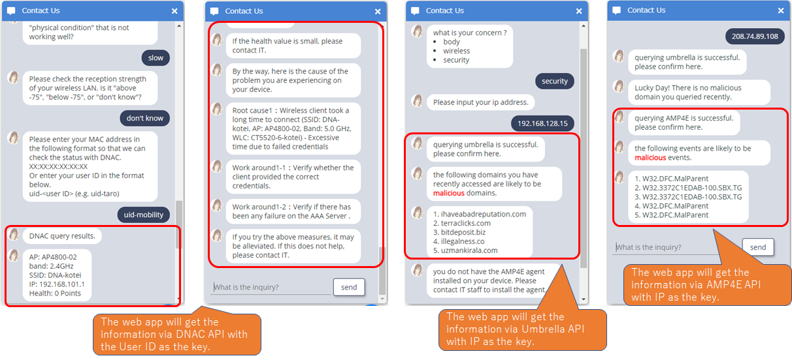

# Using chatbot to leverage DNAC

[](https://developer.cisco.com/codeexchange/github/repo/Ataru-Ohashi/fy22-hackathon)

By using DNAC simply, we aim to reduce the burden on administrators in troubleshooting wireless LANs and improve the service level for end users.



This is written in Python 3.7.x and references these popular libraries : 
* base64
* json
* logging
* os
* re
* sys
* time
* traceback
* flask
* requests
* urllib3
* urllib3.exceptions

This work will be announced by Team scrum at [APJC SE Innovation Challenge: FY22 Hackathon](https://apjc-se.cisco.com/index.php/2021/06/16/apjc-se-innovation-challenge-fy22-hackathon/) event.


## Use Case Description

* DNA Assurance is a very attractive content for customer demonstrations.
* There are even customers who decide to buy DNAC (DNA-A) based on the DNA Assurance demo alone.
* However, usually only administrators can see the DNAC management screen.
* In terms of actual operation, the administrator needs to open the screen to check every time there is an inquiry from a user.


## Installation

1. Get latest these files from repository:
```
code
├── chatux12_dnac_umbrella_amp4e.py
├── config.json
├── dictionary.json
└── index.html
```

2. Put files to specific server or laptop.
3. Update config.json according to Configuration section.


## Configuration

Update the following values in config.json to suit your environment:
```
"hostname": "[DNA server hostname]"
"username": "[DNA server access user]"
"password": "[DNA server access password]"
"umbrella_api_key": "[Umbrella api-key]"
"amp4e_hostname": "[AMP4E hostname]"
"amp4e_id": "[AMP4E access id]"
"amp4e_key": "[AMP4E access key]"
```


## Usage

1. Run chatux12_dnac_umbrella_amp4e.py on server or laptop.
2. Access index.html using HTTP from client.


### DevNet Sandbox

I don't have the right [DevNet Sandbox](https://developer.cisco.com/site/sandbox/) environment.

## How to test the software

Put and run this code on laptop.


## Known issues

I don't have known issues.

## Getting help

If you have questions, concerns, bug reports, etc., please mail to aohashi@cisco.com or create an issue against this repository.

## Getting involved

Please refer to [CONTRIBUTING](./CONTRIBUTING.md) file.

## Credits and references
